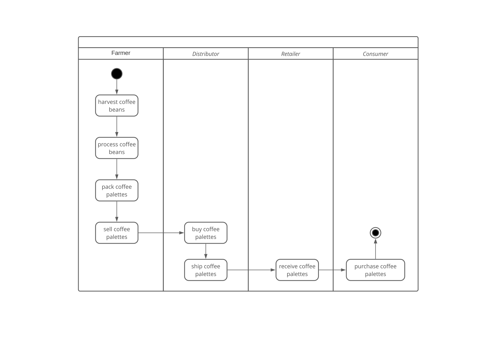
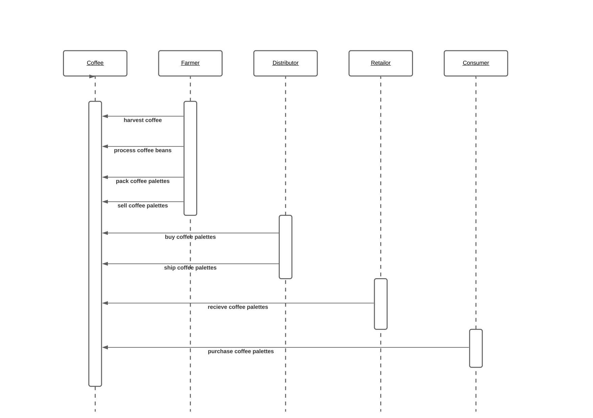
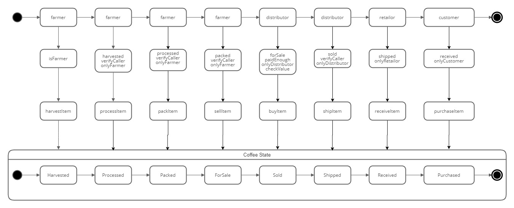
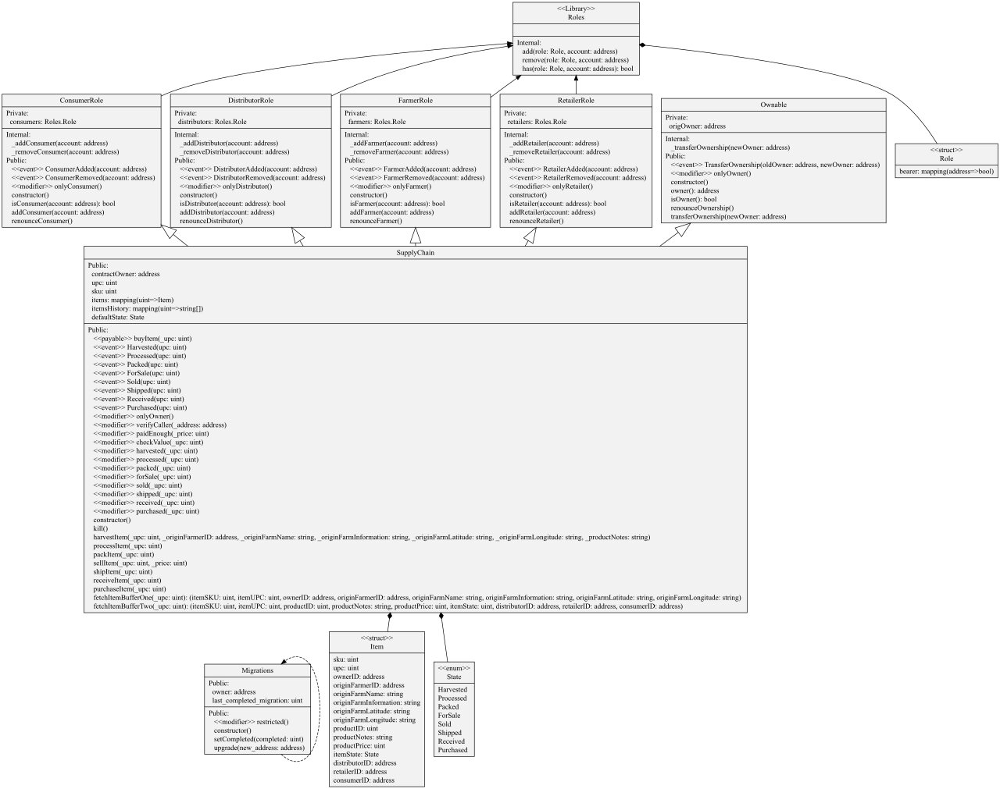

##  Project write-up - UML
### Activity diagram

### Sequence diagram

### State diagram

### Class diagram

##  Project write-up - Libraries
Only the Role library is used which was given with the boilerplate code

## Project write-up - IPFS
IPFS is not used

## General Write Up

transaction hash:    0x135c24ea56ce620914fe7d7e011fbf0bd9523c78e5082f299b547ddaf0a7d64c
contract address:    0x80C6dc79D92167639faA4509363c821e93bEA81c

####  Version Details
* Truffle v5.1.55 (core: 5.1.55)
* Solidity v0.5.16 (solc-js)
* Node v12.15.0
* Web3.js v1.2.9

